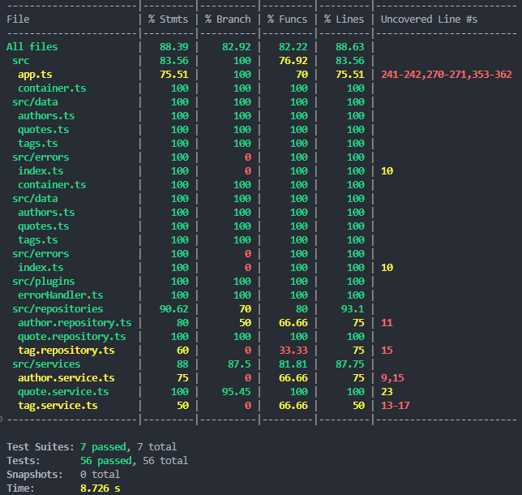

# Quotes API

This project provides an API to retrieve random quotes with filtering options, as well as additional endpoints to manage tags and authors. It includes a layered architecture for data management, business logic, and dependency injection, along with custom error handling and a comprehensive test suite.

## Table of Contents

- [Quotes API](#quotes-api)
  - [Table of Contents](#table-of-contents)
  - [Getting Started](#getting-started)
    - [Prerequisites](#prerequisites)
    - [Installation](#installation)
    - [Running the Server](#running-the-server)
  - [Folder Structure](#folder-structure)
  - [Architecture Overview](#architecture-overview)
  - [Endpoints](#endpoints)
    - [Health Check](#health-check)
    - [Random Quotes](#random-quotes)
    - [Quote by ID](#quote-by-id)
    - [All Tags](#all-tags)
    - [Tag by ID](#tag-by-id)
    - [All Authors](#all-authors)
    - [Author by ID](#author-by-id)
  - [Quote Filters](#quote-filters)
  - [Swagger Documentation](#swagger-documentation)
    - [Swagger Setup](#swagger-setup)
  - [Error Handling](#error-handling)
    - [Error Types](#error-types)
    - [Error Response Format](#error-response-format)
    - [Example](#example)
  - [Testing](#testing)
    - [Test Structure](#test-structure)
    - [Running Tests](#running-tests)
  - [Examples](#examples)
  - [Future Improvements](#future-improvements)
  - [License](#license)
  - [Acknowledgments](#acknowledgments)

## Getting Started

### Prerequisites

- Node.js (>= 14.x)
- npm

### Installation

Clone the repository and install dependencies:

```bash
git clone <repository-url>
cd <repository-folder>
npm install
```

### Running the Server

To start the server in development mode:

```bash
npm run dev
```

The server will be running at `http://localhost:3000`.

## Folder Structure

```
src
├── app.ts                                # Application setup for testing and server setup
├── container.ts                          # Dependency injection container
├── data            
│   ├── quotes.ts                         # JSON data containing quotes
│   ├── authors.ts                        # JSON data containing authors
│   └── tags.ts                           # JSON data containing tags
├── errors            
│   └── index.ts                          # Custom error classes
├── plugins           
│   └── errorHandler.ts                   # Global error handler plugin
├── repositories            
│   ├── quote.repository.ts               # Repository for quote data access
│   ├── author.repository.ts              # Repository for author data access
│   └── tag.repository.ts                 # Repository for tag data access
├── services            
│   ├── quote.service.ts                  # Service layer handling quote business logic
│   ├── author.service.ts                 # Service layer handling author business logic
│   └── tag.service.ts                    # Service layer handling tag business logic
├── types           
│   ├── quote.ts                          # Type definitions for Quote and QuoteFilters
│   ├── author.ts                         # Type definitions for Author
│   └── tag.ts                            # Type definitions for Tag
└── index.ts                              # Main entry point for server setup and Swagger configuration

tests
├── integration
│   └── api.test.ts                       # Integration tests for API endpoints
└── unit
    ├── app.test.ts                       # Unit tests for the application (setup and server start)
    ├── container.test.ts                 # Unit tests for dependency injection container setup
    ├── errors
    │   └── index.test.ts                 # Unit tests for custom error classes
    ├── plugins
    │   └── errorHandler.test.ts          # Unit tests for error handler plugin
    ├── repositories
    │   ├── quote.repository.test.ts      # Unit tests for Quote repository
    │   ├── author.repository.test.ts     # Unit tests for Author repository
    │   └── tag.repository.test.ts        # Unit tests for Tag repository
    ├── services
    │   ├── quote.service.test.ts         # Unit tests for Quote service
    │   ├── author.service.test.ts        # Unit tests for Author service
    │   └── tag.service.test.ts           # Unit tests for Tag service
    └── types
        ├── quote.test.ts                 # Tests for Quote and QuoteFilters types
        ├── author.test.ts                # Tests for Author type
        └── tag.test.ts                   # Tests for Tag type
```

## Architecture Overview

The project follows a layered architecture with a clear separation of responsibilities:

1. **Repository Layer**: Manages data access and filtering for quotes, authors, and tags
2. **Service Layer**: Contains business logic and interacts with the repositories
3. **Dependency Injection**: `container.ts` initializes and manages service instances for better modularity and testability
4. **Error Handling**: Centralized in `errorHandler.ts` with custom error classes in `errors/index.ts`
5. **API Routes**: Defined in `app.ts` and loaded by `index.ts` for modularity
6. **Testing Setup**: Comprehensive unit and integration tests for validation and functionality

## Endpoints

### Health Check

- **GET** `/health`
  - Returns server status.

### Random Quotes

- **GET** `/quotes/random`
  - Retrieves random quotes with optional filters.

### Quote by ID

- **GET** `/quotes/:id`
  - Retrieves a specific quote by its ID.
  - **Parameters**:
    - `id` (string): The ID of the quote to retrieve.

### All Tags

- **GET** `/tags`
  - Retrieves all available tags.

### Tag by ID

- **GET** `/tags/:id`
  - Retrieves a specific tag by its ID.
  - **Parameters**:
    - `id` (string): The ID of the tag to retrieve.

### All Authors

- **GET** `/authors`
  - Retrieves all available authors.

### Author by ID

- **GET** `/authors/:id`
  - Retrieves a specific author by their ID.
  - **Parameters**:
    - `id` (string): The ID of the author to retrieve.

## Quote Filters

The `/quotes/random` endpoint supports the following filters via query parameters:

| Filter        | Type   | Description                                           |
| ------------- | ------ | ----------------------------------------------------- |
| `limit`     | number | Maximum number of quotes to return                    |
| `maxLength` | number | Maximum length (character count) of quote content     |
| `minLength` | number | Minimum length (character count) of quote content     |
| `tags`      | string | Comma-separated tags (e.g.,`Success,Inspirational`) |
| `author`    | string | Author name (exact match, case-insensitive)           |

## Swagger Documentation

This project uses Swagger for automatically generated API documentation.

- After starting the server, you can access the Swagger UI at: `http://localhost:3000/documentation`
- The Swagger UI provides an interactive interface to test API endpoints, view request and response schemas, and explore all available parameters.

### Swagger Setup

Swagger is configured using Fastify plugins (`@fastify/swagger` and `@fastify/swagger-ui`). The documentation includes the following features:

- **Tags and Descriptions**: Organized by tags for clear navigation
- **Query Parameter Documentation**: Detailed parameter descriptions for each endpoint
- **Schemas**: Schemas for request validation and response types (e.g., `Quote`, `Author`, `Tag`)

## Error Handling

The API uses structured error handling to provide clear, consistent error responses.

### Error Types

- **ValidationError** (400): Occurs when the input data is invalid (e.g., invalid filter values).
- **NotFoundError** (404): Returned if a requested resource, such as a quote or author by ID, is not found.
- **ServiceError** (500): Indicates an internal server error.

### Error Response Format

Error responses follow this structure:

```json
{
  "status": "error",
  "message": "Error message",
  "code": HTTP status code
}
```

### Example

A request for a non-existing tag ID might return:

```json
{
  "status": "error",
  "message": "Tag not found",
  "code": 404
}
```

## Testing

The project uses **Jest** and **Supertest** for comprehensive testing, including unit and integration tests. These tests ensure that all components, including services, error handling, and repositories, function as expected.

### Test Structure

- **Unit Tests**: Located in `tests/unit/`, these tests validate individual components such as services, repositories, error handling, and the dependency injection container.
- **Integration Tests**: Located in `tests/integration/`, these tests validate the API endpoints, ensuring proper responses for various request scenarios.

### Running Tests

To run all tests:

```bash
npm test
```

To run tests in watch mode:

```bash
npm run test:watch
```

To check test coverage:

```bash
npm run test:coverage
```

The test suite verifies that all services and endpoints function as expected, ensuring error handling and filtering logic work correctly.




## Examples

- Get a random quote:
  ```
  GET http://localhost:3000/quotes/random
  ```
- Get two random quotes:
  ```
  GET http://localhost:3000/quotes/random?limit=2
  ```
- Get a quote by ID:
  ```
  GET http://localhost:3000/quotes/:id
  ```
- Get quotes with a maximum length of 100 characters:
  ```
  GET http://localhost:3000/quotes/random?maxLength=100
  ```
- Get quotes tagged as "Success":
  ```
  GET http://localhost:3000/quotes/random?tags=Success
  ```
- Get all tags:
  ```
  GET http://localhost:3000/tags
  ```
- Get a tag by ID:
  ```
  GET http://localhost:3000/tags/:id
  ```
- Get all authors:
  ```
  GET http://localhost:3000/authors
  ```
- Get an author by ID:
  ```
  GET http://localhost:3000/authors/:id
  ```

## Future Improvements

- Consider adding authentication for secured access

## License

This project is licensed under the MIT License. See `LICENSE` for more details.

## Acknowledgments

This project uses quotes, authors, and tags data from a curated list for demonstration purposes.
