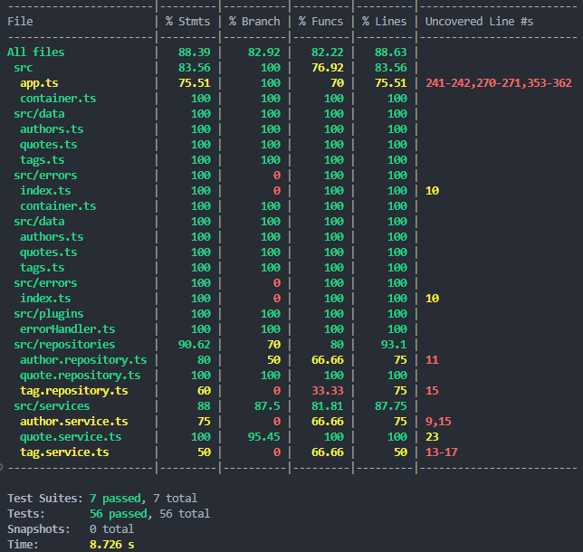

# Quotes API

This project provides an API to retrieve random quotes with filtering options, along with additional endpoints to manage tags and authors. It is structured with a Clean Architecture approach, strictly separating domain, application, infrastructure and interface layers. This design improves modularity, testability, and flexibility while enforcing domain-driven design principles.

## Table of Contents

- [Quotes API](#quotes-api)
  - [Table of Contents](#table-of-contents)
  - [Getting Started](#getting-started)
    - [Prerequisites](#prerequisites)
    - [Installation](#installation)
    - [Running the Server](#running-the-server)
  - [Folder Structure](#folder-structure)
  - [Architecture Overview](#architecture-overview)
  - [Endpoints](#endpoints)
    - [Health Check](#health-check)
    - [Random Quotes](#random-quotes)
    - [Quote by ID](#quote-by-id)
    - [All Tags](#all-tags)
    - [Tag by ID](#tag-by-id)
    - [All Authors](#all-authors)
    - [Author by ID](#author-by-id)
  - [Quote Filters](#quote-filters)
  - [Swagger Documentation](#swagger-documentation)
    - [Swagger Setup](#swagger-setup)
  - [Error Handling](#error-handling)
    - [Error Types](#error-types)
    - [Error Response Format](#error-response-format)
    - [Example](#example)
  - [Testing](#testing)
    - [Test Structure](#test-structure)
    - [Running Tests](#running-tests)
  - [Examples](#examples)
  - [Future Improvements](#future-improvements)
  - [License](#license)
  - [Acknowledgments](#acknowledgments)

## Getting Started

### Prerequisites

- Node.js (>= 14.x)
- npm

### Installation

Clone the repository and install dependencies:

```bash
git clone <repository-url>
cd <repository-folder>
npm install
```

2. Create a `.env` file with the MongoDB connection string and other required variables:
```plaintext
DB_CONNECTION=mongodb://quote-db:27017/quotes
JWT_PUBLIC_KEY=your_jwt_public_key
```

### Running the Server

To start the server in development mode:

```bash
npm run dev
```

The server will be running at `http://localhost:3002`.

## Folder Structure

```
src
├── application/                       # Use cases and DTOs
│   ├── dtos/                          # Data transfer objects (DTOs) for quotes, authors, and tags
│   └── use-cases/                     # Application use cases organized by entity
├── container.ts                       # Dependency injection container
├── domain/                            # Core business logic and domain models
│   ├── entities/                      # Entities representing core business models
│   ├── repositories/                  # Interfaces for data access (repositories)
│   └── value-objects/                 # Value objects encapsulating business rules
├── infrastructure/                    # Implementation of repositories and persistence
│   ├── repositories/                  # Concrete repository implementations
│   └── persistence/                   # In-memory storage for quotes, authors, and tags
│   └── config/                        # Configuration files for MongoDB connection
│       └── database.ts
├── interface/                         # API interface layer
│   ├── api/                           # Routes, controllers, and presenters
│   └── errors/                        # Error handling for API responses
├── plugins                            # Fastify plugins (e.g., error handlers)
└── index.ts                           # Main entry point for server setup and Swagger configuration

tests
├── integration
│   └── api.test.ts                    # Integration tests for API endpoints
└── unit
    ├── application                    # Tests for application layer (use cases and DTOs)
    ├── domain                         # Tests for entities, value objects, and domain repositories
    ├── infrastructure                 # Tests for repository implementations
    ├── interface                      # Tests for controllers and presenters
    └── plugins                        # Tests for Fastify plugins (e.g., error handler)
```

## Architecture Overview

The project adheres to Clean Architecture principles, ensuring a clear separation of responsibilities:

1. **Domain Layer**: Contains entities, value objects, and repository interfaces for domain logic.
2. **Application Layer**: Houses the use cases, serving as an intermediary for business logic in the domain layer, while abstracting away infrastructure dependencies.
3. **Infrastructure Layer**: Implements repositories and persistence mechanisms.
4. **Interface Layer**: Provides API routes, controllers, and presenters for transforming domain data for external use.
5. **Dependency Injection**: Manages dependencies across layers for modularity and testability.
6. **Error Handling**: Centralized error management with custom error types for consistency.

## Endpoints

### Health Check

- **GET** `/health`
  - Returns server status.

### Random Quotes

- **GET** `/quotes/random`
  - Retrieves random quotes with optional filters.

### Quote by ID

- **GET** `/quotes/:id`
  - Retrieves a specific quote by its ID.
  - **Parameters**:
    - `id` (string): The ID of the quote to retrieve.

### All Tags

- **GET** `/tags`
  - Retrieves all available tags.

### Tag by ID

- **GET** `/tags/:id`
  - Retrieves a specific tag by its ID.
  - **Parameters**:
    - `id` (string): The ID of the tag to retrieve.

### All Authors

- **GET** `/authors`
  - Retrieves all available authors.

### Author by ID

- **GET** `/authors/:id`
  - Retrieves a specific author by their ID.
  - **Parameters**:
    - `id` (string): The ID of the author to retrieve.

## Quote Filters

The `/quotes/random` endpoint supports the following filters via query parameters:

| Filter      | Type   | Description                                         |
| ----------- | ------ | --------------------------------------------------- |
| `limit`     | number | Maximum number of quotes to return                  |
| `maxLength` | number | Maximum length (character count) of quote content   |
| `minLength` | number | Minimum length (character count) of quote content   |
| `tags`      | string | Comma-separated tags (e.g.,`Success,Inspirational`) |
| `author`    | string | Author name (exact match, case-insensitive)         |

## Swagger Documentation

This project uses Swagger for automatically generated API documentation.

- After starting the server, you can access the Swagger UI at: `http://localhost:3002/documentation`
- The Swagger UI provides an interactive interface to test API endpoints, view request and response schemas, and explore all available parameters.

### Swagger Setup

Swagger is configured using Fastify plugins (`@fastify/swagger` and `@fastify/swagger-ui`). The documentation includes the following features:

- **Tags and Descriptions**: Organized by tags for clear navigation
- **Query Parameter Documentation**: Detailed parameter descriptions for each endpoint
- **Schemas**: Schemas for request validation and response types (e.g., `Quote`, `Author`, `Tag`)

## Error Handling

The API uses structured error handling to provide clear, consistent error responses.

### Error Types

- **ValidationError** (400): Occurs when the input data is invalid (e.g., invalid filter values).
- **NotFoundError** (404): Returned if a requested resource, such as a quote or author by ID, is not found.
- **ServiceError** (500): Indicates an internal server error.

### Error Response Format

Error responses follow this structure:

```json
{
  "status": "error",
  "message": "Error message",
  "code": HTTP status code
}
```

### Example

A request for a non-existing tag ID might return:

```json
{
  "status": "error",
  "message": "Tag not found",
  "code": 404
}
```

## Testing

The project uses **Jest** and **Supertest** for comprehensive testing, including unit and integration tests. These tests ensure that all components, including services, error handling, and repositories, function as expected.

### Test Structure

- **Unit Tests**: Located in `tests/unit/`, these tests validate individual components such as services, repositories, error handling, and the dependency injection container.
- **Integration Tests**: Located in `tests/integration/`, these tests validate the API endpoints, ensuring proper responses for various request scenarios.

### Running Tests

To run all tests:

```bash
npm test
```

To run tests in watch mode:

```bash
npm run test:watch
```

To check test coverage:

```bash
npm run test:coverage
```

The test suite verifies that all services and endpoints function as expected, ensuring error handling and filtering logic work correctly.



## Examples

- Get a random quote:
  ```
  GET http://localhost:3002/quotes/random
  ```
- Get two random quotes:
  ```
  GET http://localhost:3002/quotes/random?limit=2
  ```
- Get a quote by ID:
  ```
  GET http://localhost:3002/quotes/:id
  ```
- Get quotes with a maximum length of 100 characters:
  ```
  GET http://localhost:3002/quotes/random?maxLength=100
  ```
- Get quotes tagged with either "Success" or "Inspirational":
  ```
  GET http://localhost:3002/quotes/random?tags=Success|Inspirational
  ```
- Get all tags:
  ```
  GET http://localhost:3002/tags
  ```
- Get a tag by ID:
  ```
  GET http://localhost:3002/tags/:id
  ```
- Get all authors:
  ```
  GET http://localhost:3002/authors
  ```
- Get an author by ID:
  ```
  GET http://localhost:3002/authors/:id
  ```

## Future Improvements

- Consider adding authentication for secured access
- Containerize the backend project along with a database using a Dockerfile and docker-compose
- Implement data persistence in a database to replace in-memory storage and ensure long-term data retention
- Develop a frontend for the application using React
- Implement end-to-end tests with Cypress for comprehensive testing across user interactions
- Plan deployments with Kubernetes to enable scalable, resilient, and containerized application management

## License

This project is licensed under the MIT License. See `LICENSE` for more details.

## Acknowledgments

This project uses quotes, authors, and tags data from a curated list for demonstration purposes.
